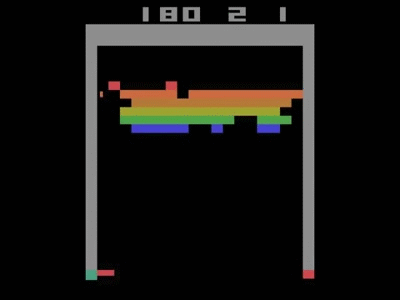

# Deep Q Networks (DQN)

###### Link to the paper: [Mnih et al. (Google DeepMind)](https://www.cs.toronto.edu/~vmnih/docs/dqn.pdf) (2013), and [Mnih et al. (DeepMind)](https://www.nature.com/nature/journal/v518/n7540/full/nature14236.html) (2015)

### Historical context

_This paper arguably launched the field of deep reinforcement learning._ The paper was published in 2013, only a year after [AlexNet](https://papers.nips.cc/paper/4824-imagenet-classification-with-deep-convolutional-neural-networks) brought convolutional neural networks (CNN) into the public eye after a show-stopping error rate of 15.4% on the [ImageNet ILSVRC](http://www.image-net.org/challenges/LSVRC/). The DQN paper was the first to _successfully_ bring the powerful perception of CNNs to the reinforcement learning problem.

This architecture was trained separately on seven games from Atari 2600 from the Arcade Learning Environment. On six of the games, it surpassed all previous approaches, and on three of them, it beat human experts. Two years later, when the DQN article was featured in the journal [Nature](https://www.nature.com/nature/journal/v518/n7540/full/nature14236.html), it achieved human performance on 49 separate games. The optimal policy was even learned: focusing fire on the side, and getting the ball stuck in the top of the screen.

### Basic idea

Rather than finding a policy directly, we can approximate the optimal action-value function, $$Q^* : S \times A \rightarrow \mathbb{R}$$. This function maps state-action pairs to their expected discounted return. Then, finding the optimal policy would be simple: $$\pi^*(s) = \arg \max_a Q^*(s, a)$$. We just choose the action at every step that greedily maximizes our action-value function.

**The goal of the DQN architecture is to train a network to approximate the $$Q^*$$ function.**

First, we will introduce the objective function and network architecture. Then, we will discuss some of the pitfalls of the training procedure (hint: it's unstable).

### The loss function

First, we can write the Bellman optimality equation for $$Q^\pi$$:

$$
Q^\pi(s,a) = r + \gamma Q^\pi(s', \pi(s))
$$

However, this Bellman optimality equation only holds when $$\pi$$ has converged to the optimal policy $$\pi^*$$. Otherwise, there will be some difference between $$Q(s, a)$$ and $$\gamma Q(s', \pi(s))$$. This is known as the _temporal difference error_ $$\delta$$:

$$
 \delta = \underbrace{\hat{Q}(s, a)}_\text{current est.} - \underbrace{\left( r + \gamma \max_{a'} \hat{Q}(s', a') \right)}_\text{one-step lookahead}
$$

Our goal is to minimize this quantity. Our loss will be defined as the _squared_ temporal difference error, similar to a mean squared error metric.

$$
L(\theta) = \delta_\theta^2 = \left(\hat{Q}_\theta(s, a) - \left(r + \gamma \max_{a'} \hat{Q} (s', a')\right)\right)^2
$$

We will use this gradient to update the weights of our Q-network.

### The neural network architecture

Since the function is approximating a Q function, we require that the input to the neural network be the state variables, and the output be the predicted Q-values.